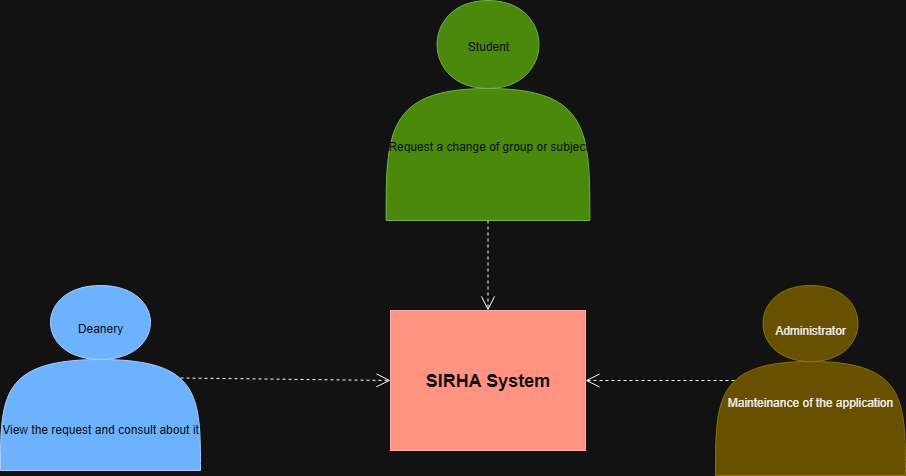
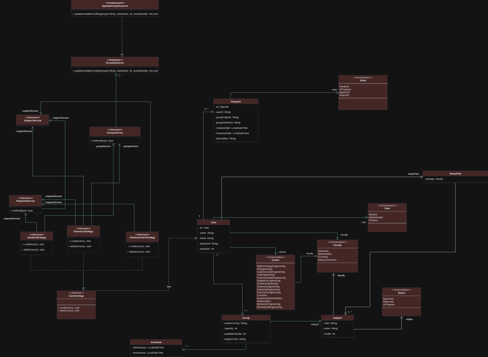
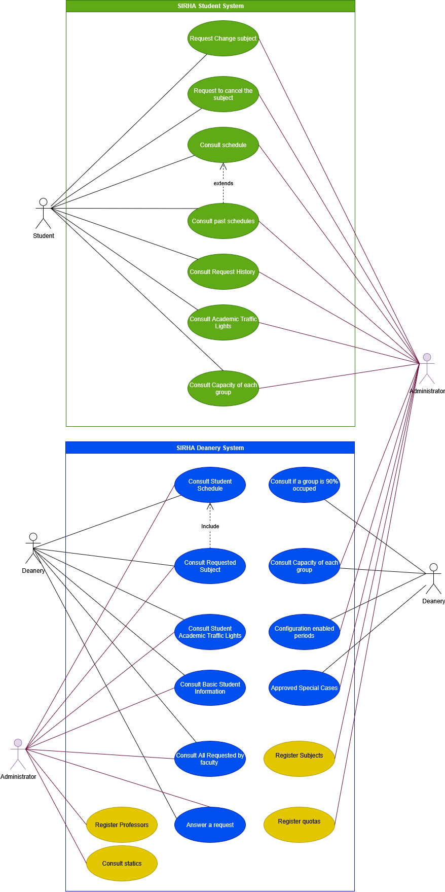
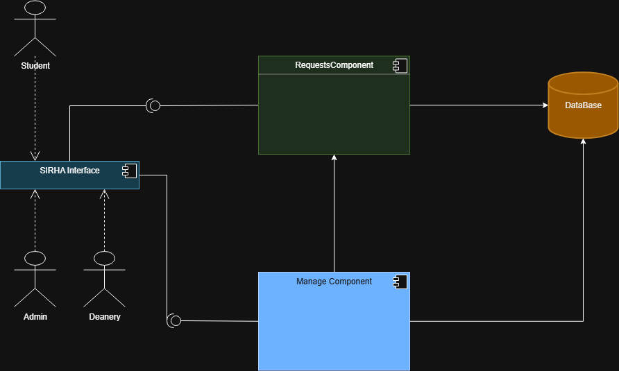
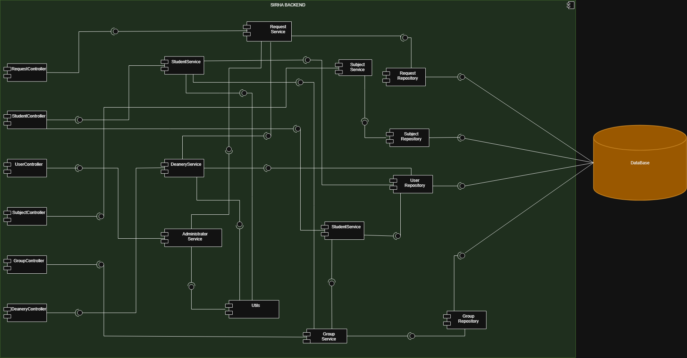
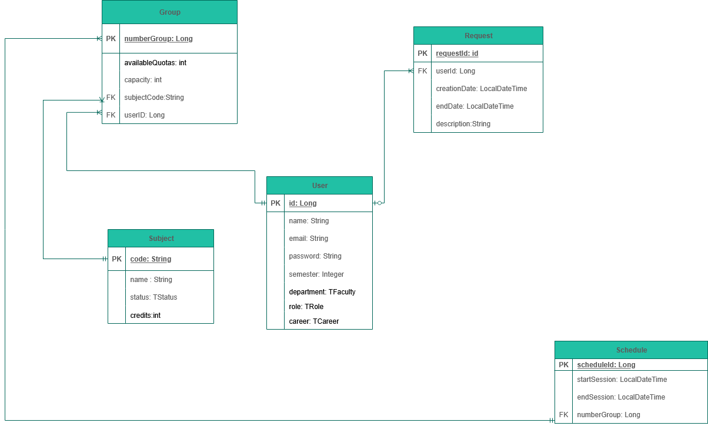
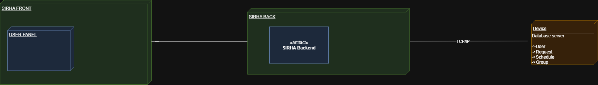
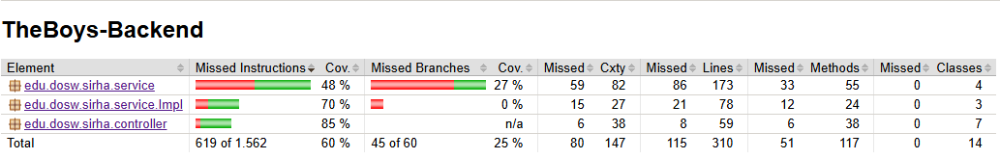
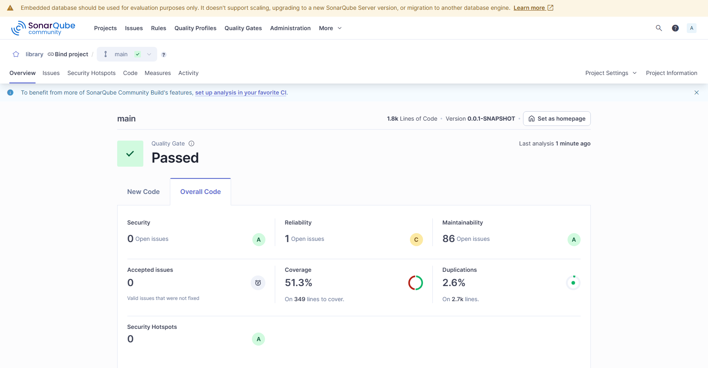

# TheBoys-Backend

Integrantes:

- Juan Sebastian Puentes Julio
- Tulio Riaño
- Nestor Lopez
- Daniel Patiño
- Julian Camilo Lopez

---

## 🌲Ramificacion y Estrategia de Versionamiento de Ramas

- Para mantener un control claro del desarrollo, seguimos una estructura de ramas basada en Git Flow:

    - `main`: Contiene el código estable y listo para producción.
    - `develop`: Rama principal de desarrollo.
    - `feature/<funcionalidadRealizada>`: Se crea a partir de develop para implementar una nueva característica o mejora.

---

## 💻 **Como Ejecutar El Proyecto**

Para compilar, ejecutar y probar el proyecto, seguiremos los siguientes pasos:

1. *Clonar El Repositorio*:
    ```bash
    `git clone https://github.com/tulio3101/TheBoys-Backend.git`

2. *Entrar al proyecto*:
    ```bash
    `cd TheBoys-Backend.git`

3. *Compilar*:
    ```bash
    `mvn clean compile`

4. *Ejecutar el Proyecto*:
    ```bash
    `mvn spring-boot:run`

5. *Ejecutar Pruebas*:
    ```bash
    `mvn test`

---

## 1. 🎨 **Diseño**:

_Diagrama De Contexto_

Se considera el sistema de manejo de solicitudes SIRHA donde administradores, decanos y estudiantes podrán realizar peticiones y responder a las mismas:



---

_Diagrama de Clases:_

Se realizó la diagramación y modelado del problema aplicando diversos patrones de diseño con el fin de lograr una arquitectura flexible y de fácil mantenimiento.
Entre los patrones implementados destacan:

- Observer : Utilizado para la notificacion de respuestas de una solicitud.

- Strategy : Empleado para definir diferentes comportamientos en el manejo de responsabilidades de los usuarios y la gestión de solicitudes.


---

_Diagrama De Casos De Uso:_

Se definieron las funcionalidades específicas de cada uno de los actores que interactúan con el sistema, identificando sus responsabilidades, acciones y permisos dentro de la aplicación. De esta manera, aseguramos que cada usuario pueda acceder unicamente a sus responsabilidades.



---

_Diagrama De Componentes General:_

Tres componentes básicos:
- SIRHA FRONT: Experiencia de usuario.
- SIRHA BACK: Lógica de la aplicación.
- DB: Persistencia.



---

_Diagrama De Componentes Especifico:_

Se definieron las diferentes relaciones entre las capas de controladores, servicios y repositorios, asegurando un flujo de datos coherente y bajo acoplamiento.



---

_Diagramas De Secuencia:_

Se realiza la diagramación de las funcionalidades propuestas, siguiendo los principios SOLID.


---

_Diagrama De Bases De Datos:_

Se presenta la estructura del modelo de datos, en la cual se almacena la información gestionada por el sistema.




Esta estructura define las entidades principales, sus atributos y las relaciones existentes entre ellas.

---
_Diagrama de Despliegue:_

Para el despliegue de la aplicación, se plantean tres nodos:



Esta estructura muestra la arquitectura logica del sistema, donde se especifican sus componentes.

## 2. 🔥 **Jacoco**

Cobertura Actual Del Codigo:

## 

---

## 3. 🔥 **Swagger**


---

## 4. 🔥 **MongoDB**

Base de datos desplegada en MongoDB Atlas:


Ejemplo de documento en la coleccion de materias:


---

## 5. 🔥 **SonarQube**

Analisis estatico ejecutado con SonarQube Actual:



---

## 6. 🔥 **Docker**


