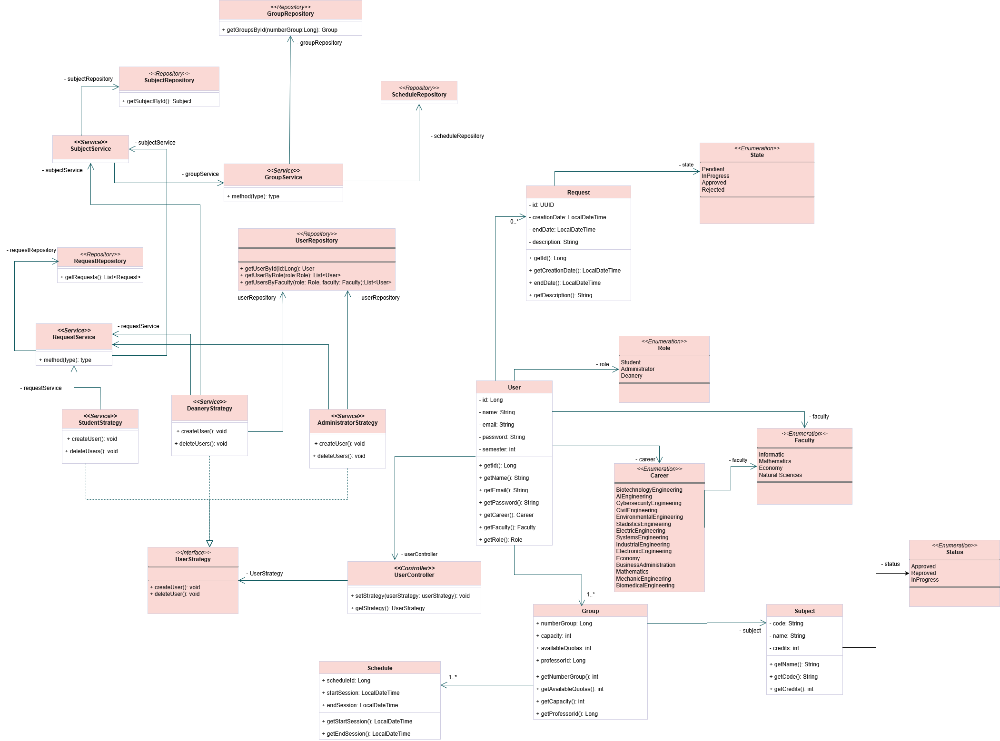
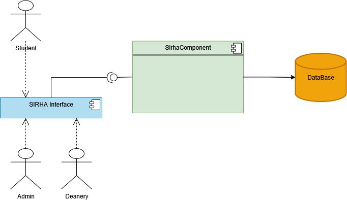
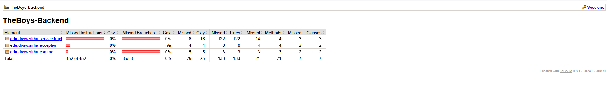
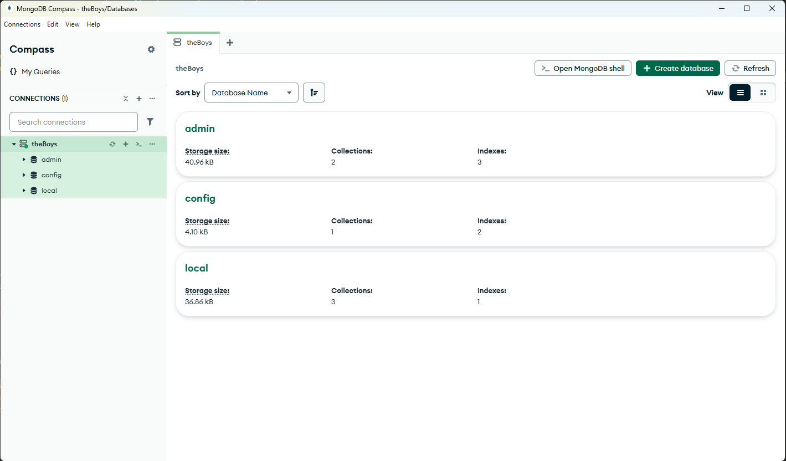

# TheBoys-Backend

Integrantes:

- Juan Sebastian Puentes Julio
- Tulio Riaño
- Nestor Lopez
- Daniel Patiño
- Julian Camilo Lopez

---

1. **Diseño**:

_Diagrama De Contexto_

- Se considera el sitema de manejo de solicitudes SIRHA donde administradores, decanos y estudiantes podrán realizar peticiones y responder a las mismas:

_Diagrama de Clases:_

- Se realizó la diagramacion del problema a resolver aplicando patrones de diseño y siguiendo los principios SOLID:

_Diagrama De Casos De Uso:_

_Diagrama De Componentes General:_

Diagrama De Componentes Especifico:\_

_Diagramas De Secuencia:_

- Se realizó el diseño de la mayoria de funciones que brinda el sistema SIRHA.

_Diagrama De Bases De Datos:_

---

2. 🔥 **Jacoco**

## 

3. 🔥 **Swagger**

4. 🔥 **MongoDB**

## 💻 **Como ejectutar el proyecto**
 - Clonar El Repositorio `https://github.com/tulio3101/TheBoys-Backend.git`
 - Desde el cmd ejecutamos `cd TheBoys-Backend`
 - Alli con ayuda de maven ejectutamos `mvn clean compile`
 - Una vez compile ejecutamos `mvn spring-boot:run`