# TheBoys-Backend

Integrantes:

- Juan Sebastian Puentes Julio
- Tulio Riaño
- Nestor Lopez
- Daniel Patiño
- Julian Camilo Lopez

---

## 🌲Ramificacion y Estrategia de Versionamiento de ramas

- Se realiza la respectiva ramificacion creando las ramas `develop` y `feature` para desarrollar las nuevas funcionalidades de la aplicacion. Para los commits manejamos el estandar `feat/modulo: Accion Realizada - Nombre Quien Lo Hizo` para que se entienda con claridad lo elaborado.

---

## 💻 **Como ejecutar el proyecto**

- Clonar El Repositorio: `https://github.com/tulio3101/TheBoys-Backend.git`
- Desde el cmd, ejecutamos: `cd TheBoys-Backend`
- Allí, con ayuda de maven, ejecutamos: `mvn clean compile`
- Una vez compile, ejecutamos: `mvn spring-boot:run`
- Para las pruebas, ejecutamos el comando: `mvn test`

---

## 1. 🎨 **Diseño**:

_Diagrama De Contexto_

- Se considera el sistema de manejo de solicitudes SIRHA donde administradores, decanos y estudiantes podrán realizar peticiones y responder a las mismas:

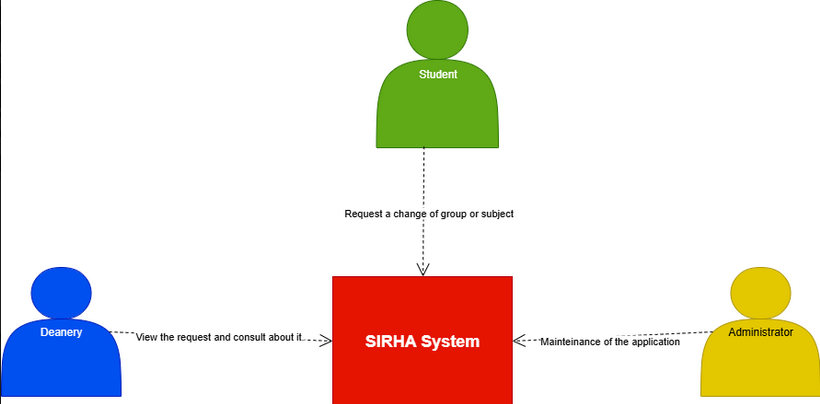

---

_Diagrama de Clases:_

- Se realizó la diagramacion del problema a resolver aplicando patrones de diseño y siguiendo los principios SOLID:

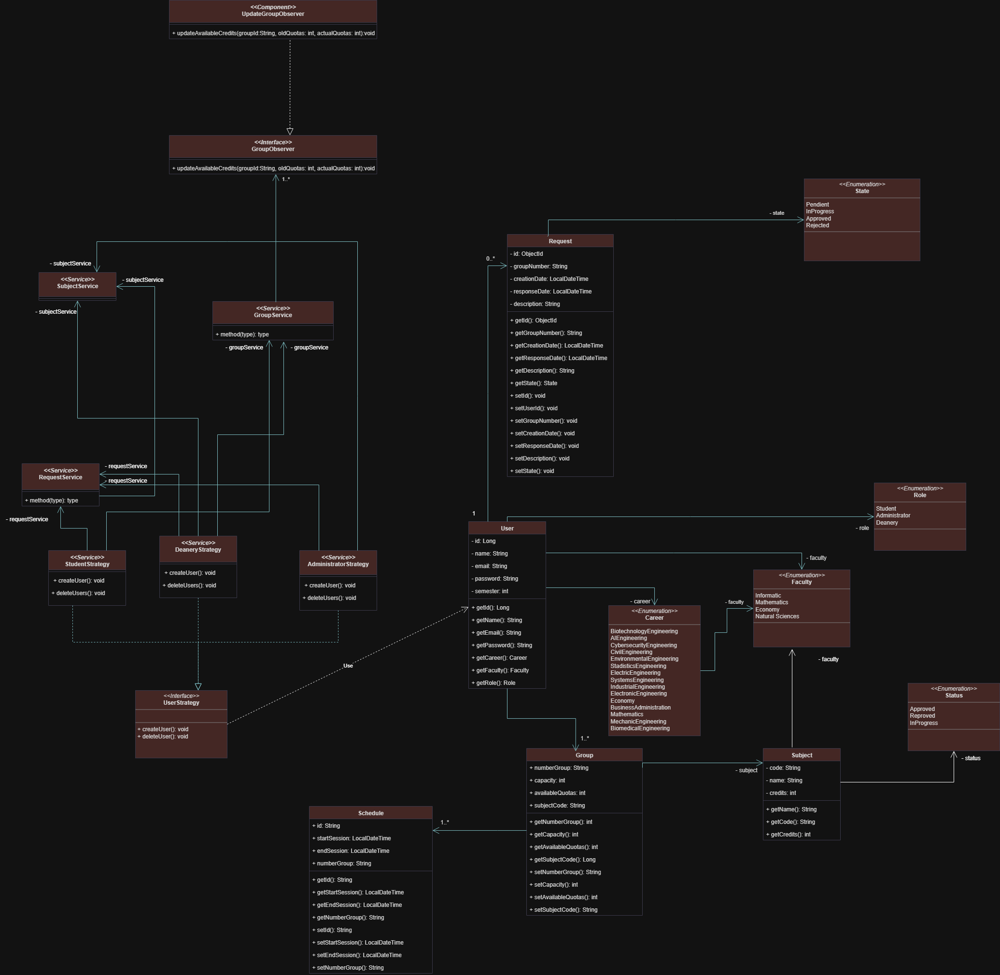

---

_Diagrama De Casos De Uso:_

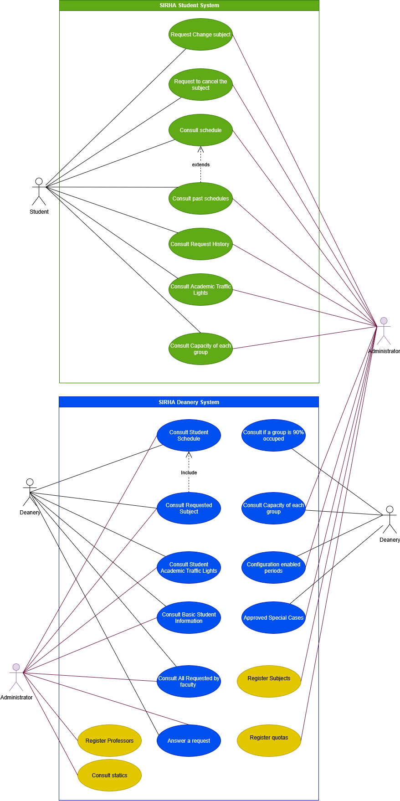

---

_Diagrama De Componentes General:_

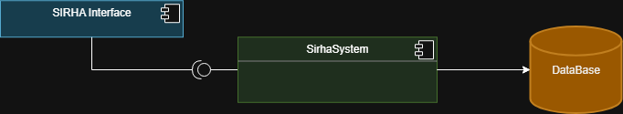

---

_Diagrama De Componentes Especifico:_

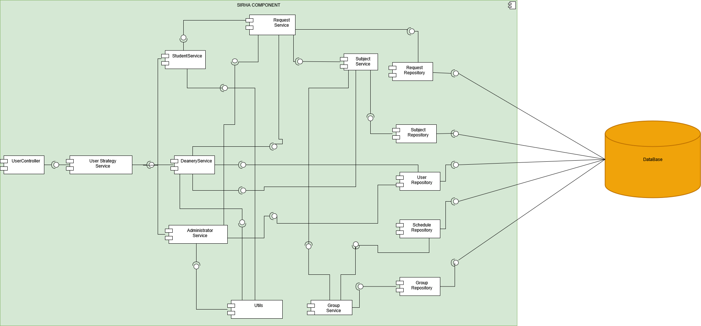

---

_Diagramas De Secuencia:_

- Se realizó el diseño de la mayoria de funciones que brinda el sistema SIRHA.

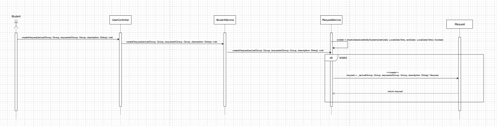

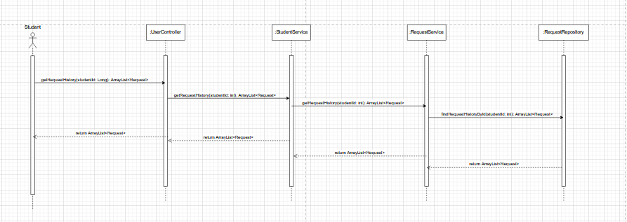

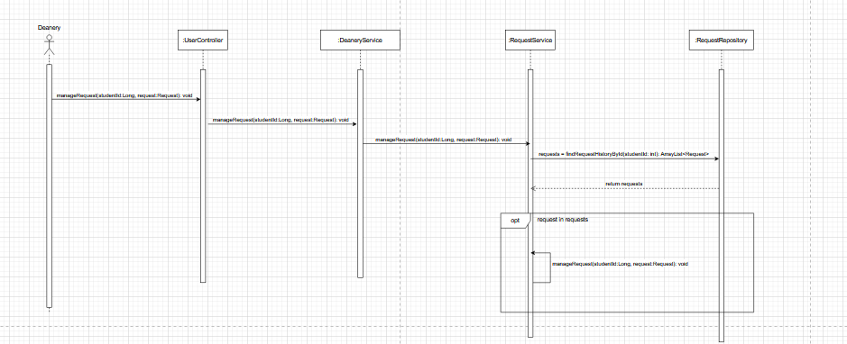

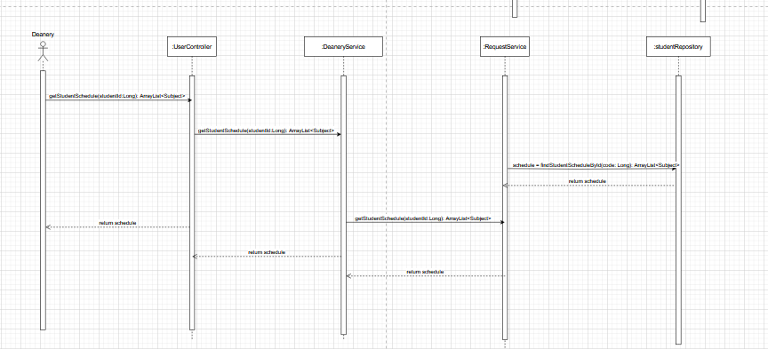

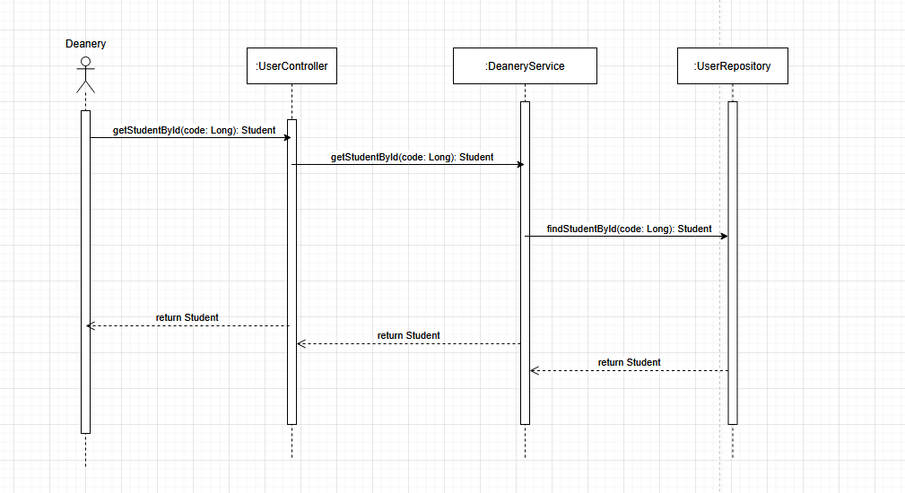

---

_Diagrama De Bases De Datos:_

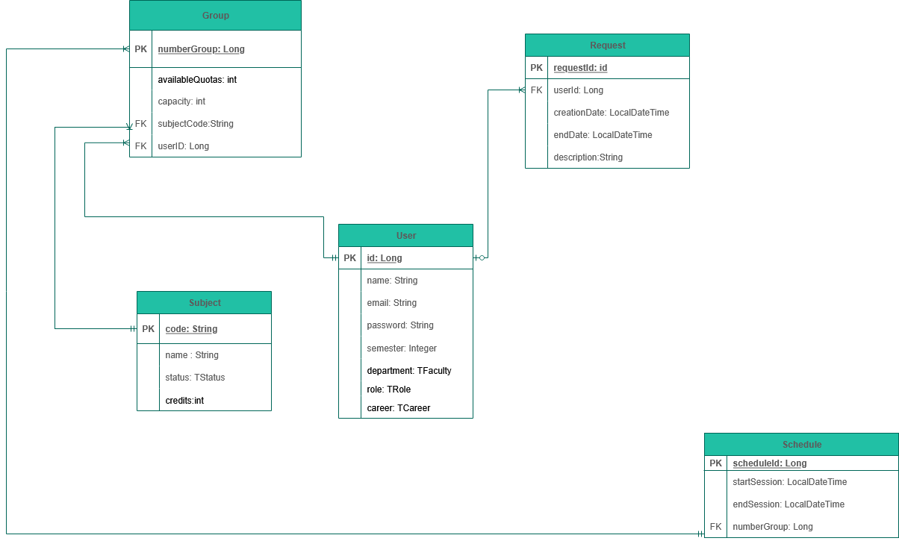

_Diagrama De Bases De Datos Corregido:_

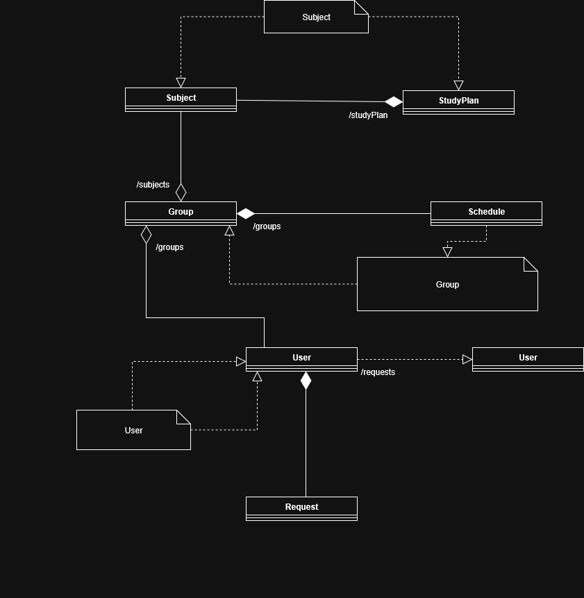

---
_Diagrama de Despliegue:_
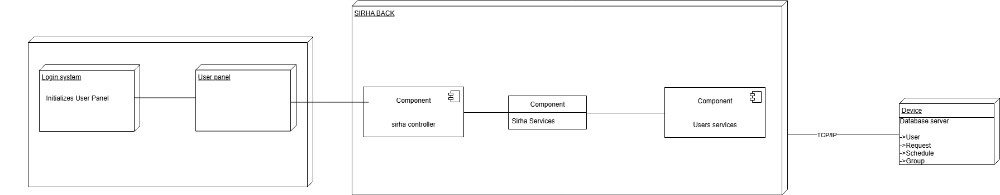

## 2. 🔥 **Jacoco**

## 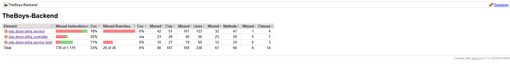

---

## 3. 🔥 **Swagger**

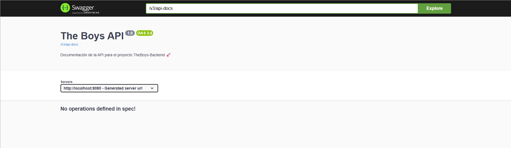

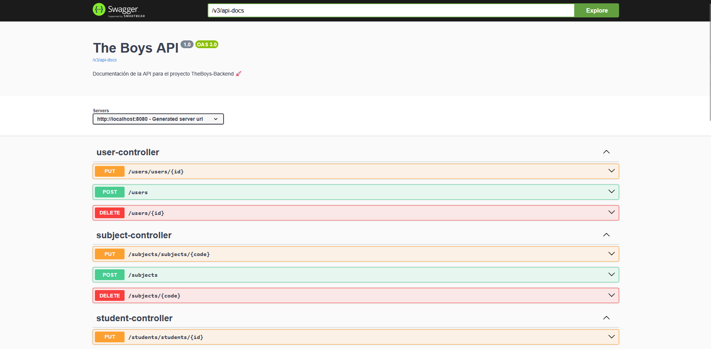

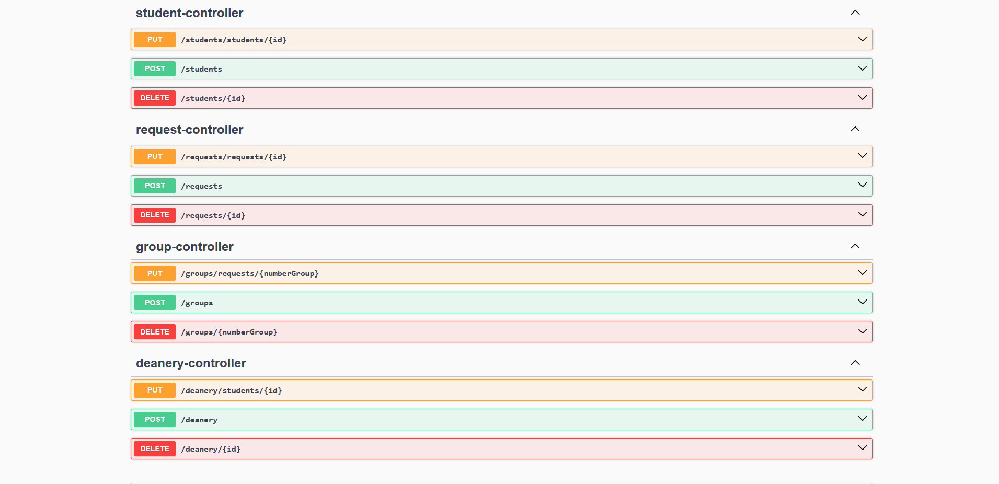

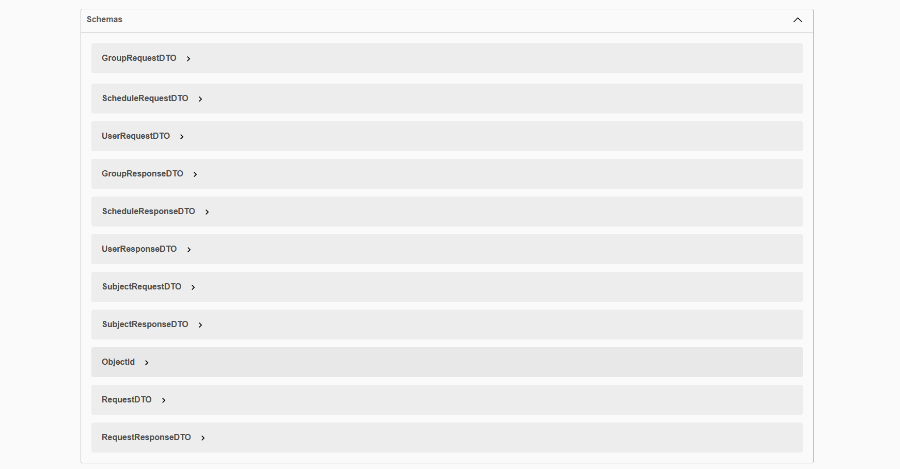

---

## 4. 🔥 **MongoDB**

Base de datos desplegada en MongoDB Atlas:

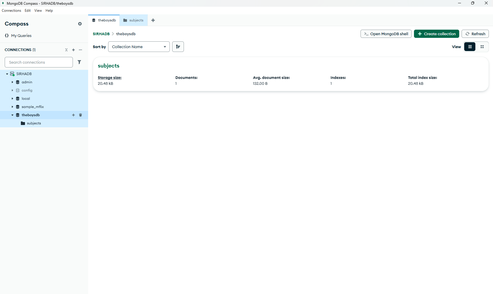

Ejemplo de documento en la coleccion de materias:
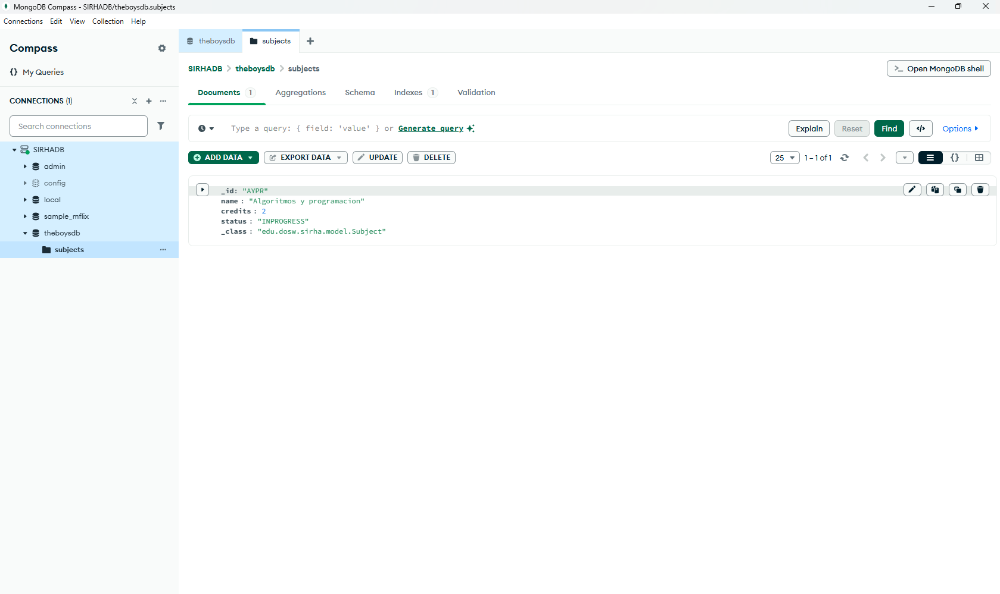

---

## 5. 🔥 **SonarQube**

Analisis estatico ejecutado con SonarQube:

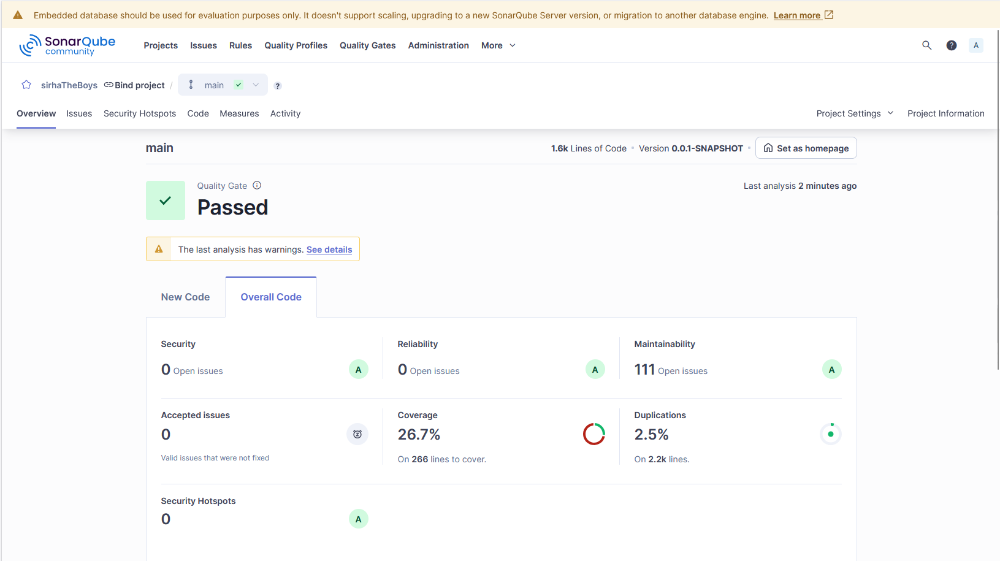

---

## 6. 🔥 **Docker**

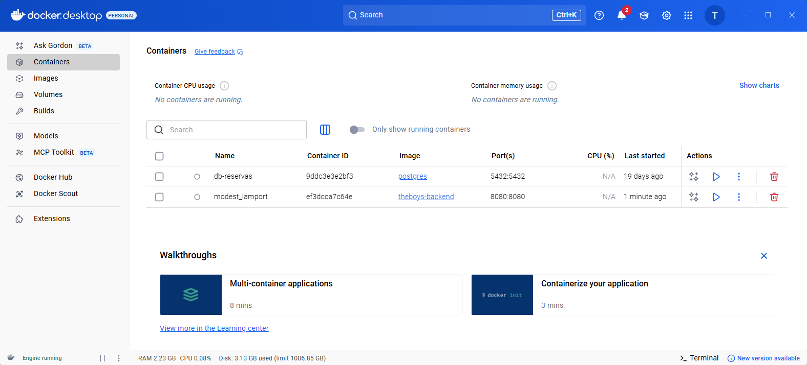
