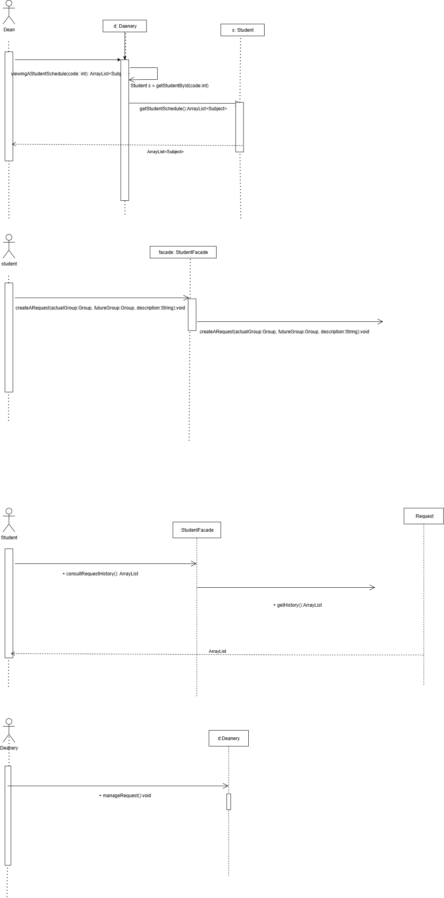
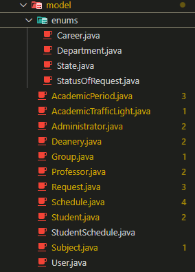
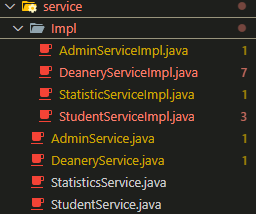
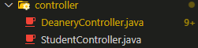
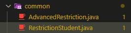
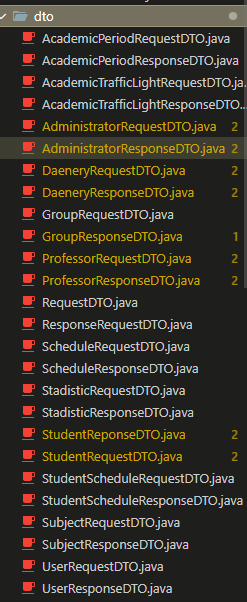

# TheBoys-Backend

Integrantes:

- Juan Sebastian Puentes Julio
- Tulio Riaño
- Nestor Lopez
- Daniel Patiño
- Julian Camilo Lopez

---

1.🔥 **Diseño**:

_Diagrama De Contexto_

- Se considera el sitema de manejo de solicitudes SIRHA donde administradores, decanos y estudiantes podrán realizar peticiones y responder a las mismas:

_Diagrama de Clases:_

- Se realizó la diagramacion del problema a resolver aplicando patrones de diseño y siguiendo los principios SOLID:

_Diagrama De Casos De Uso:_

_Diagrama De Componentes General:_

Diagrama De Componentes Especifico:_

_Diagramas De Secuencia:_

- Se realizó el diseño de la mayoria de funciones que brinda el sistema SIRHA.

_Diagrama De Bases De Datos:_

---

2. 🔥 **Desarrollo De Codigo**

- Modelo:

- Repositorios:

- Servicios: Faltan algunas implementaciones de los servicios.

- Controller: Faltó 1 controlador:

- Clases Validadoras:

- DTOS:

---

3. 🔥 **Swagger**
