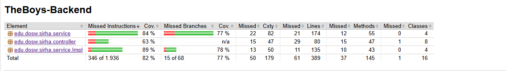

# TheBoys-Backend

Integrantes:

- Juan Sebastian Puentes Julio
- Tulio Riaño
- Nestor Lopez
- Daniel Patiño
- Julian Camilo Lopez

---

## 🌲Ramificacion y Estrategia de Versionamiento de Ramas

Implementamos una estrategia de ramificación basada en Git Flow, utilizando las ramas main para producción y develop para integración, complementadas con ramas feature para nuevas funcionalidades, posteriormente las ramas feature se eliminan para generar un mejor flujo y no generar ruido en nuestro repostorio.

---

## 💻 **Como Ejecutar El Proyecto**

Para compilar, ejecutar y probar el proyecto, seguiremos los siguientes pasos:

1. _Clonar El Repositorio_:

   ```bash
   git clone https://github.com/SIRHA-TheBoys/TheBoys-Backend

   ```

2. _Entrar al proyecto_:

   ```bash
   cd TheBoys-Backend

   ```

3. _Construir y correr los contenedores_
   ```bash
   docker-compose up -d
   ```
4. _Utilice el siguiente comando para obtener un shell bash dentro del contedor de la aplicación._
   ```bash
   docker-compose exec app bash
   ```
5. _Dentro de esta terminal se pueeden ejecutar comandos de manera manual, no es obligatorio para hacer pruebas ya que con el contenedor corriendo es suficiente_
   ```bash
   mvn clean verify
   mvn spring-boot:run
   ```


---

## 1. 🎨 **Diseño**:

_Diagrama De Contexto_

Se considera el sistema de manejo de solicitudes SIRHA donde administradores, decanos y estudiantes podrán realizar peticiones y responder a las mismas:


---

_Diagrama de Clases:_

Se realizó la diagramación y modelado del problema aplicando diversos patrones de diseño con el fin de lograr una arquitectura flexible y de fácil mantenimiento.
Entre los patrones implementados destacan:

- Observer : Utilizado para la notificacion de respuestas de una solicitud.

- Strategy : Empleado para definir diferentes comportamientos en el manejo de responsabilidades de los usuarios y la gestión de solicitudes.

## 

_Diagrama De Casos De Uso:_

Se definieron las funcionalidades específicas de cada uno de los actores que interactúan con el sistema, identificando sus responsabilidades, acciones y permisos dentro de la aplicación. De esta manera, aseguramos que cada usuario pueda acceder unicamente a sus responsabilidades.


---

_Diagrama De Componentes General:_

Tres componentes básicos:

- SIRHA FRONT: Experiencia de usuario.
- SIRHA BACK: Lógica de la aplicación.
- DB: Persistencia.


---

_Diagrama De Componentes Especifico:_

Se definieron las diferentes relaciones entre las capas de controladores, servicios y repositorios, asegurando un flujo de datos coherente y bajo acoplamiento.


---

_Diagramas De Secuencia:_

Se realiza la diagramación de las funcionalidades propuestas, siguiendo los principios SOLID.


---

_Diagrama De Bases De Datos:_

Se presenta la estructura del modelo de datos, en la cual se almacena la información gestionada por el sistema.


Esta estructura define las entidades principales, sus atributos y las relaciones existentes entre ellas.

---

_Diagrama de Despliegue:_

Para el despliegue de la aplicación, se plantean tres nodos:


Esta estructura muestra la arquitectura logica del sistema, donde se especifican sus componentes.

## 2. 🔥 **Jacoco**

Cobertura Actual Del Codigo:

## 

---

## 3. 🔥 **Swagger**

Uso de SwaggerUI para visualizar con mayor detalle los EndPoints desarrollados:


---

## 4. 🔥 **MongoDB**

Base de datos desplegada en MongoDB Atlas:


En las siguientes capturas se mostrará un ejemplo del JSON de diferentes documentos:

- Para las solicitudes:

```json
{
"_id": {"$oid": "671e3c2f0a2b5a00017f1001"},
"userId": "1000099001",
"groupOriginId": "CALD-1",
"groupDestinyId": "CALD-2",
"creationDate": {
"$date": "2025-10-27T14:00:00.000Z"
},
"description": "I need to switch due to a schedule conflict with another course.",
"state": "PENDIENT",
"_class": "edu.dosw.sirha.model.entity.Request"
}
```

- Para los usuarios (ADMINISTRADOR):

```json
{
  "_id": "1000099097",
  "name": "Daniel Patino Mejia",
  "email": "daniel.patino-m@mail.escuelaing.edu.co",
  "password": "holamundo123",
  "role": "ADMINISTRATOR",
  "_class": "edu.dosw.sirha.model.entity.User"
}
```
- Para los usuarios (STUDENT):
```json
{
  "_id": "1000100444",
  "name": "Juan Sebastian Puentes Julio",
  "email": "juan.puentes@mail.escuelaing.edu.co",
  "password": "admin",
  "role": "STUDENT",
  "semester": 5,
  "career": "SYSTEMS_ENGINEERING",
  "studyPlan": {
    "subjectsCode": [
      "CALD",
      "ALLI",
      "IPRO",
      "PRI1IS",
      "FCO1",
      "CALI",
      "FIS1",
      "MPIN",
      "DDYA",
      "HGCL",
      "CALV",
      "PRYE",
      "MYSD",
      "LYMD",
      "FUEC",
      "FIS2",
      "ODSC",
      "FUPR",
      "DOPO",
      "TPYC",
      "ECDI",
      "AYSR",
      "PRI2IS",
      "DOSW",
      "FDSI",
      "ARSW",
      "PTIA",
      "SOGR",
      "TDSE",
      "SWNT",
      "ET01",
      "ET02",
      "ET03",
      "OGR1",
      "OGR2",
      "OGR3",
      "OGR4"
    ],
    "average": 4
  },
  "numberGroupId": [
    "1",
    "2",
    "3",
    "4",
    "5",
    "6",
    "7",
    "8",
    "9",
    "10",
    "11",
    "12",
    "13",
    "14",
    "15",
    "16",
    "17",
    "18",
    "19",
    "20",
    "21",
    "22",
    "23",
    "24",
    "25",
    "26",
    "27",
    "28",
    "29",
    "30",
    "31",
    "32",
    "33",
    "34"
  ],
  "requestsId": [],
  "_class": "edu.dosw.sirha.model.entity.User"
}
```
- Para las materias:

```json
{
  "_id": "CALD",
  "name": "Cálculo Diferencial",
  "credits": 3,
  "semester": 1,
  "status": "APPROVED",
  "faculty": "MATHEMATICS",
  "_class": "edu.dosw.sirha.model.entity.Subject"
}
```
- Para los grupos:
```json
{
  "_id": "1",
  "capacity": 28,
  "availableQuotas": 5,
  "subjectCode": "PRI2IS",
  "usersId": [
    "1000100444"
  ],
  "schedules": [
    {
      "startSession": {
        "$date": "2025-10-27T07:00:00.000Z"
      },
      "endSession": {
        "$date": "2025-10-27T08:30:00.000Z"
      }
    },
    {
      "startSession": {
        "$date": "2025-11-01T07:00:00.000Z"
      },
      "endSession": {
        "$date": "2025-11-01T08:30:00.000Z"
      }
    }
  ],
  "_class": "edu.dosw.sirha.model.entity.Group"
}
```
---

## 5. 🔥 **SonarQube**

Analisis estatico ejecutado con SonarQube:


---

## 6. 🔥 **Docker**

Uso de docker para correr la aplicacion en un contenedor:


